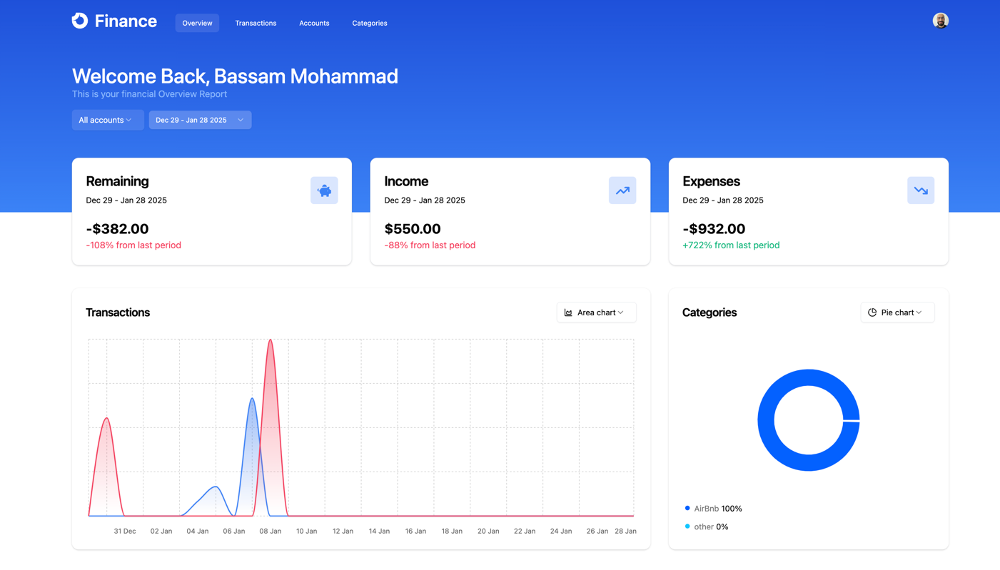

Finance App

Finance App est une application web conçue pour aider les utilisateurs à gérer leurs finances personnelles de manière efficace. L'application permet d'enregistrer vos revenus, vos dépenses, et de les catégoriser par compte. Elle offre également des graphiques pour analyser vos finances et permet l'importation de transactions via des fichiers CSV.

Fonctionnalités
Gestion des transactions :
 - Ajouter et suivre vos revenus et dépenses.
 - Catégoriser les transactions (par exemple : nourriture, transport, etc.).
 - Gérer plusieurs comptes financiers.

Analyse des finances :
 - Visualisation des données via des graphiques interactifs (Recharts).
 - Analyse des tendances financières.

Importation des données :
 - Importer des transactions directement via des fichiers CSV.
 
Sécurisation et authentification :
 - Authentification utilisateur robuste via Clerk.

Déploiement rapide et accessible :
 - Déployé sur Vercel pour une accessibilité optimale.

Technologies et outils utilisés
Frontend :
 - React.js : Bibliothèque pour la construction de l'interface utilisateur.
 - Next.js (app router) : Framework React pour le rendu côté serveur (SSR) et côté client.
 - TailwindCSS : Framework CSS pour un style rapide et réactif.
 - Recharts : Bibliothèque pour créer des graphiques interactifs.
 - React Query : Gestion des appels API et des états côté client.

Backend :
 - Hono : Framework rapide basé sur Node.js pour construire des API.
 - Node.js : Runtime JavaScript utilisé pour le backend.

Base de données :
 - PostgreSQL : Base de données relationnelle pour stocker les données utilisateur.
 - Drizzle ORM : ORM léger et efficace pour interagir avec PostgreSQL.

Authentification :
 - Clerk : Solution d'authentification pour la gestion des utilisateurs.

Déploiement :
 - Vercel : Plateforme de déploiement pour héberger l'application.

# Installation et exécution

1. Clonez le repository :
   git clone https://github.com/your-username/finance-app.git
   cd finance-app

2. Installez les dépendances :
   npm install

3. Configurez les variables d'environnement :
   Créez un fichier `.env` à la racine avec vos clés Clerk et la configuration PostgreSQL.
   

4. Démarrer l'application : 
   npm run dev
   

Améliorations futures
 - Intégration avec des comptes bancaires pour synchroniser automatiquement les transactions.
 - Ajout d'un tableau de bord pour les prévisions financières basées sur les tendances.
 - Exportation des données financières dans des formats comme PDF ou Excel.
 - Gestion multi-langue pour une meilleure accessibilité.

Contribuer
Si vous souhaitez contribuer au projet, voici les étapes à suivre :

Fork le repository.
Créez une branche pour votre fonctionnalité (git checkout -b feature/ma-fonctionnalité).
Commitez vos modifications (git commit -m 'Ajout d'une nouvelle fonctionnalité').
Poussez la branche (git push origin feature/ma-fonctionnalité).
Ouvrez une Pull Request.
